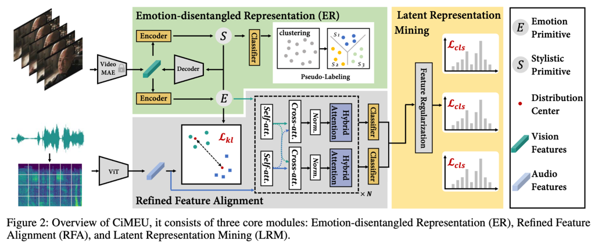

# CiMEU: Culture-Independent Multimodal Emotion Understanding



## Abstract
Automatic emotion recognition~(AER) is a challenging task. Recent studies attempt to incorporate multimodal features to achieve a more comprehensive understanding of emotional states. However, two critical challenges are often overlooked: (1) the variability in expressing the same emotion due to cultural and individual differences, and (2) the similarity among different emotional expressions in form. To address these issues, we propose a multimodal AER framework named Culture-Independent Multimodal Emotion Understanding (CiMEU). It comprises three core modules: The Emotion-disentangled Representation module aims to separate general emotional primitives from culture or individual specific stylistic primitives, thereby improving the model’s ability to generalize emotional representations across diverse cultural and situational contexts; The Refined Feature Alignment module mitigates representational ambiguities within each modality and integrates them to form more robust emotional representations; The Latent Representation Mining module encourages the model to learn diverse emotional representations while retaining discriminative information, preventing collapse into a single dominant expression pattern and enhancing the recognition of complex, nuanced emotional states. Extensive experiments demonstrate that the proposed CiMEU framework consistently achieves significant performance gains, outperforming state-of-the-art methods in multimodal emotion recognition. The models and codes will be released upon acceptance.

## Summary

[//]: # (- We analyze the core challenges in current AER and identify that cultural and individual differences in expression styles lead to intra-modal representational distribution shifts, which are a key factor in declining the generalization ability of existing models.)

[//]: # (- We propose a novel multimodal emotion understanding framework termed CiMEU to achieve culture-independent and robust emotion representation learning through the Emotion-disentangled Representation, Refined Feature Alignment, and Latent Representation Mining modules.)

[//]: # (- Comprehensive experiments conducted on three publicly available cross-cultural datasets demonstrate that CiMEU significantly alleviates the cross-group generalization bottleneck in AER tasks, achieving state-of-the-art performance with a 3.1\%–6.5\% improvement over existing methods.)

## Getting Started

### Environment
OS: Ubuntu 18.04.5 LTS 

Python: 3.7

Pytorch: 2.0.0

CUDA: 11.7

GPU: A 3090

### Setup
```shell script
$ cd CiMEU
$ conda create -n env_name python=3.7
$ conda activate env_name
$ pip install -r requirements.txt
```
### Data Preparation
- **DFEW data:**
<!-- 1. Download pre-processed by VideoMAE V2 npy data: [\[Google Drive\]][\[115\]](https://115.com/s/swzjtf233kn?password=c455&#get_features)
2. Unzip the npy data to `./get_features/`


**If you want to generate npy data by yourself, please refer to the following guidelines:** -->

- **Cropped face and original video:**
1. To construct npy inputs, please download the official data of [DFEW](https://dfew-dataset.github.io).  
According to [official](https://dfew-dataset.github.io) requirements, you can obtain the data address.
  
- **VideoMAE V2 video features generation manually:**
1. Please refer to the official instructions of VideoMAE V2:  [https://github.com/OpenGVLab/VideoMAEv2](https://github.com/OpenGVLab/VideoMAEv2)
2. The pre-trained model file we used is `vit_g_hybrid_pt_1200e_k710_ft.pth`, fill in the [official file](https://docs.google.com/forms/d/e/1FAIpQLSd1SjKMtD8piL9uxGEUwicerxd46bs12QojQt92rzalnoI3JA/viewform?usp=sf_link) to obtain it, 
download it to `VideoMAEv2/pre_models/vit_g_hybrid_pt_1200e_k710_ft.pth`.

### Train
```shell
# run forward model for the fold-5 of DFEW
python main_NTL.py --dataset=DFEW --num_class=7 --is_face=True --data_mode=norm --data_set=5

# run backward model for the fold-5 of DFEW
python main_NTL.py --dataset=DFEW --num_class=7 --is_face=True --data_mode=rv --data_set=5
```
###
